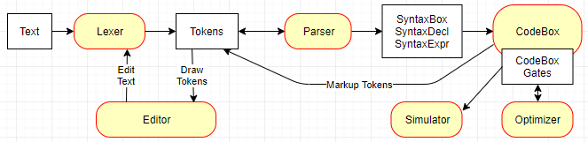
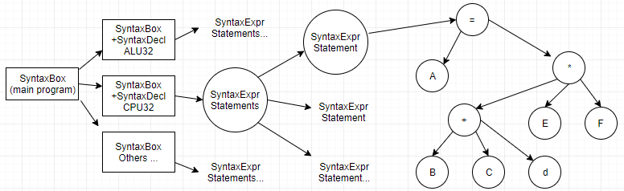

# BIT, a Hardware Description Language

BIT is a hardware description language that I designed and wrote in 1992.
Sadly, the original C++ source code has been lost forever.  In 2011, I
resurrected the project and re-wrote BIT in C#.  The new version includes 
a context sensitive editor, real time language parser,  optimizing compiler, 
and CPU simulator.

In addition to BIT (the hardware description language), I also designed a 32
bit CPU.  You can read more about the hardware description language and CPU 
here http://gosub.com/Bit

## Architectural Overview

# 

## Lexer

The `Lexer` breaks the text into the tokens of the language.  Once tokenized, 
they can be enumerated and marked up by the `Parser` or displayed by the 
`Editor`.  Each token carries enough information to display its color (i.e. 
token type) or give the user feedback from the parser and code generator. 
`ReplaceText` can be used to insert or delete text, and the tokens in the 
affected area will be regenerated.

## Editor

The `Editor` control uses the `Lexer` to enumerate the tokens, draw them
on the screen, and edit the text.  User edits are sent to the lexer
which then sends a `TextChanged2` event back to the application so it can
recompile the code.  Text changes are recorded to implement undo/redo.

The application uses `TokenColorOverrides` to draw different color 
backgrounds as the user moves the mouse over the text.  It also hooks
`MouseHoverTokenChanged` to display information reported by the parser
and code generator, such as error or type information.

## Parser

The `Parser` is recursive descent, and generates a syntax tree composed of
`SyntaxBox`, `SyntaxDecl`, and `SyntaxExpr`.  As it parses, the tokens
are marked with information such as error text and connecting parenthesis.
I know it doesn't mean much in todays world, but the parser is pretty fast, 
taking just 7 milliseconds to parse 1370 lines of text on my laptop.  

Syntax tree for boxes that contain the statement `A=(B+C+d)*E*F`

## CodeBox and Code Generation

`CodeBox` has two distinct passes.  The first pass walks the syntax tree, 
collects type information, generates *intermediate* code, and marks up 
tokens with more information for the user.  The *intermediate* code 
includes only the logic gates of the box being compiled, but not any gates
of the referenced boxes.  It is stripped of higher level constructs
such as `set`, `dup`, `==`, and number constants.  Arrays are 
expanded to individual bits.  `if` is converted to sum of products.

The second pass, executed by `LinkCode`, recursively includes all of the 
referenced boxes and synthesizes all the gates necessary for simulating the 
circuit.  The final un-optimized output, ready for simulation, is just a list
of boolean expressions `List<OpCodeExpr>` stored in `LinkedCode`.  

Honestly, this is the most messy part of the project, and a lot of it is 
because the class should be split into several pieces.  There should 
be at least three classes: `TypeAnalysis`, intermediate `CodeGeneration`, 
and final `GateSynthesis`.  

## Optimizer

The `Optimizer` removes unnecessary wires and gates, thereby reducing
the 32 bit CPU from 13510 to 11864 gates.  The following rules are used:

    Remove wires, embed expressions
    Remove duplicate expressions
    Remove constants: A*1=A, A+0=A, A#0=A, A#1=!A, A*0=0, A+1=1
    Remove identities: a+a=a, a*a=a, a+!a=1, a*!a=0
    Remove parenthesis: a+(b+c)=a+b+c, a*(b*c)=a*b*c, a#(b#c)=a#b#c, a#!(b#c)=!(a#b#c)
    Demorgan's law: a+!(b*c)=a+!b+!c, a*!(b+c)=a*!b*!c

This optimizer isn't all that powerful compared to the 1992 version which
implemented the [Quine–McCluskey algorithm](https://en.wikipedia.org/wiki/Quine%E2%80%93McCluskey_algorithm)

## OpCodes

The final output is a list of single bit Boolean expressions stored in a tree
structure.  Each node of the tree can represent a constant, parameter, math
operation, terminal, or expression.  Symbolic information is recorded so the
simulator can show the inputs, output, and "local variable" names.   During
gate synthesis, many thousands of anonymous expressions are created and they
are assigned names, such as `X3999`.  You can view the final output from the
main menu by clicking Simulate...View Code.  Here is a sample of the output from
the 32 bit CPU:

    ...
    X3399 = !(clock * !(X3403 * X3399));
    X3402 = !(X3403 * clock * X3399);
    X3403 = !(((X1042 * dataInBus.1) + (!X1042 * pushPopFieldNext.1)) * X3402);
    X3406 = !(X3399 * !(X3402 * X3406));
    X3417 = !(clock * !(X3421 * X3417));
    X3420 = !(X3421 * clock * X3417);
    X3421 = !(((X1042 * dataInBus.2) + (!X1042 * pushPopFieldNext.2)) * X3420);
    ...
    X15296 = ((X15338 * X15484) + (source1Reg.2 * X15485) + ((X16010 # X16042 # (X16167 + (X16166 * X16171) + (X16007 * X16170 * X16171))) * X15408) + (source1Reg.2 * X15338 * X15487) + ((source1Reg.2 + X15338) * X15488) + ((source1Reg.2 # X15338) * X15489) + (X15338 * X15335) + (((X15416 * source1Reg.2) + (!X15416 * X15338)) * X15411));
    X15297 = ((X15339 * X15484) + (source1Reg.3 * X15485) + ((X16011 # X16043 # (X16168 + (X16167 * X16172) + (X16166 * X16171 * X16172) + (X16007 * X16170 * X16171 * X16172))) * X15408) + (source1Reg.3 * X15339 * X15487) + ((source1Reg.3 + X15339) * X15488) + ((source1Reg.3 # X15339) * X15489) + (X15339 * X15335) + (((X15416 * source1Reg.3) + (!X15416 * X15339)) * X15411));
    X15298 = ((X15340 * X15484) + (source1Reg.4 * X15485) + ((X16012 # X16044 # X16174) * X15408) + (source1Reg.4 * X15340 * X15487) + ((source1Reg.4 + X15340) * X15488) + ((source1Reg.4 # X15340) * X15489) + (X15340 * X15335) + (((X15416 * source1Reg.4) + (!X15416 * X15340)) * X15411));
    ...
    
## Simulating the Circuit

Simulating is straight forward, and that's all I'll say about the implementation.
What's really needed now is an automated unit test system.  Manually testing
the CPU for each instruction is tedious, time consuming, and prone to error.  

## Bit, the Language

The BIT hardware description language is based on Boolean algebra, where logic 
signals can carry two values: TRUE or FALSE.  All logic circuits are boiled down
to the basic Boolean operators:  NOT, AND, OR, and XOR (exclusive OR). 

The basic building block in BIT is the BOX.  A box is a re-usable circuit that 
performs a Boolean calculation.  For instance:

    // Single bit adder with carry in and out
    box Add1(in a, in b, in c, out answer, out carry) is
        answer = a # b # c;        // Use XOR to calculate the result
        carry = a*b + a*c + b*c;   // Use AND and OR to calculate the carry
    end

The circuit above takes three inputs (a, b, and c) and generates a two bit sum.
This is called a full adder.  For more information about full adders, visit
[Wikipedia's Full Adder Page](https://en.wikipedia.org/wiki/Adder_%28electronics%29en.wikipedia.org/wiki/Adder_%28electronics%29).
Boxes can be composed of other boxes, so a 4 bit adder `RippleAdd4` could be
created like this:

    // A 4 bit ripple adder (very slow)
    box RippleAdd4(in cin, in left[4], in right[4], out answer[4], out carryOut) is
        bit carrys[3];
        Add1(left[0], right[0], cin, answer[0], carrys[0]);
        Add1(left[1], right[1], carrys[0], answer[1], carrys[1]);
        Add1(left[2], right[2], carrys[1], answer[2], carrys[2]);
        Add1(left[3], right[3], carrys[2], answer[3], carryOut);
    end

Obviously, we won't be using slow ripple adders in a high performance CPU.  We'll use
a [Carry-lookahead adder](https://en.wikipedia.org/wiki/Carry-lookahead_adder) instead.
Here is an example of the `if`...`elif`...`else`...`end` statement, which uses the
*sum of products* to calculate `AlignBus32In`.

    // Align the bus input on an int/short/byte - BIG ENDIAN
    //      byte: True if the reading a byte, false for short or int
    //      word: True if reading a short, false if int
    //      address: Last two bits of the address being read
    //      dataIn: The 32 bit int read from the address (divisible by 4)
    // RETURNS: The bus data re-aligned for the given type and address
    // NOTE: Data must be aligned properly for the given type
    // (int on 4 byte boundary, short on 2 byte boundary, byte anywhere)
    box AlignBus32In[32](in byte, in word, in address[2], in dataIn[32]) is
        bit zWord[16] = 0[0:16];
        bit zByte[8] = 0[0:8];
        if (byte)
            // 8 bit value (byte)
            if (address == 0)
                AlignBus32In = set(zByte, zByte, zByte, dataIn[24:8]);
            elif (address == 1)
                AlignBus32In = set(zByte, zByte, zByte, dataIn[16:8]);
            elif (address == 2)
                AlignBus32In = set(zByte, zByte, zByte, dataIn[8:8]);
            else
                AlignBus32In = set(zByte, zByte, zByte, dataIn[0:8]);
            end
        elif (word)
            // 16 bit value (short)
            if (address[1] == 0)
                AlignBus32In = set(zWord, dataIn[16:16]);
            else
                AlignBus32In = set(zWord, dataIn[0:16]);
            end
        else
            // 32 bit value (int)
            AlignBus32In = dataIn;
        end
    end

## The CPU

No hardware description language is complete without a CPU, so here it is.
First, this is what an assembly language program would look like:

    // CRC Example (in C)
    uint Crc32(uint crc, uint *table, byte *buffer, int length)
    {
        while(--length >= 0)
            crc = table[((crc >> 24) ^ *buffer++)] ^ (crc << 8);
    }

    // CRC Example (in Assembly Language)
    #define crc     r0
    #define table   r1
    #define buffer  r2
    #define length  r3

    44030001    sub     length,1
    0Cxxxxxx    bslt    crc_done            // Branch signed less than
            crc_loop:
    50240018    usr     r4,crc,24           // r4 = ((uint)crc >> 24)
    4C544202    xor.b   r4,[buffer++]       // r4 = r4 ^ *buffer++
    4D000008    sl      crc,8		
    4C601482    xor     crc,[table+r4*4]
    44040001    sub     length,1
    0Dxxxxxx    bsge    crc_loop            // Branch signed greater than or equal
             crc_done:
    404F4490    ld      pc,rlink            // Return to subroutine

And this the CPU assembly language quick reference card:

    There are 16 general purpose 32 bit registers:
        0..13       General purpose registers (R0..R13)
        14 = S      Stack (mostly by convention, not because it's very special)
        15 = PC     Program counter

    Extended registers (when X bit is set):
        0 = CC      Condition Codes
        1 = LR      Link register (used to return from subroutine)
        2..12       Reserved (will be used for interrupts)
        13..15      Map to general purpose registers (R13, S, PC)

    Push/Pop
    0000001P ######## ######## ########
        02:Push   r0..r15,cc,link
	    03:Pop    cc,link,r15..r0 **(Sorry, pop not yet implemented)**

    Conditional Branches, Jumps, and Jump to Subroutine
    001CCCCC ######## ######## ######## [optional immediate word]
        C = 20:BRN          21:BRA          22:BEQ          23:BNE
            24:BCS/BULT     25:BCC/BUGE     26:BVS          27:BVC
            28:BMI          29:BPL          2A:BULE         2B:BUGT
            2C:BSLT         2D:BSGE         2E:BSLE         2F:BSGT
            30:JSR #        Jump to subroutine (absolute)
            31:BSR #        Branch to subroutine (relative to PC)
        # = 24 bit signed value times 4, or 0x800000 for immediate value follows
        NOTE: ALU instruction 0x56 is also a jump to subroutine (e.g LD.J PC,[R0+R2*4])

    ALU integer op-code chart:
            40:LD           41:ST           42:ADD          43:ADC
            44:SUB          45:SUBC         46:SUBR         47:SUBRC
            48:CMP          49:BIT          4A:AND          4B:OR
            4C:XOR          4D:SL           4E:SLC          4F:SR
            50:USR          51:SRC          52:MIN          53:UMIN
            54:MAX          55:UMAX         56:LD.J

    CPU Instruction Modes (for ALU instructions listed above):
    01CCCCCC    MMMMDDDD    [see below for next 16 bits]
        C: Alu operation (see ALU integer chart above)
        M: Mode, the next 16 bits are defined as follows:
            0: ######## ########    D = D op #16u
            1: ######## ########    D = D op #~16u
            2: SSSS#### ########    D = S op #12
            3: SSSS#### TTTx####    D = S op #8             [#32 follows when 0x80]
            4: SSSSRRRR TTTx0nnn    D = S op (R<<n)
            5: SSSSRRRR TTTx0iii    D = S op [R]            iii = [++R],[--R],[R++],[R--]
            6: SSSSRRRR TTTx0nnn    D = D op [S+(R<<n)]
            7: SSSSRRRR TTT#####    D = S op [R+#~5ux]      [#32 follows when 0]
            8: SSSSRRRR TTT#####    D = S op [R+#5ux]
            9: SSSSRRRR TTT#####    D = S op [R+#5ux+32x]
            A: SSSSRRRR TTT#####    D = S op [R+#5ux+64x]
            B: SSSSRRRR TTT#####    D = S op [R+#5ux+96x]
            C: ####RRRR TTT#####    D = D op [R+#9ux]
            D: ####RRRR TTT#####    D = D op [R+#9ux+512x]
            E: ####RRRR TTT#####    D = D op ->[R+#9ux]     [#32 follows when 0x1F]
            F: Reserved for future
        D: Destination register (and source register 1 for two register operations)
        S: Source register 1
        R: Source register 2
        n: Three bit number to shift left (unused if the ALU operation is a shift)
        i: Pre/post inc/dec, i = (0:[++R], 1:[--R], 2:[R++], 3:[R--], 4:[R])
        x: Use extended registers (r0, r1, cc, link, ... s, pc)
        T: Type - sbyte,byte,short,ushort,int,(reserved for future: float,long,double)
                  NOTE: The right hand operand is sign extended (or zero filled) before
                  the ALU operation.  The ALU operation is always performed as a 32
                  bit integer operation.  The ALU output can be sign extended (or
                  zero filled) by setting the E bit.    #16u = unsigned 16 bit number
        #~16u = unsigned 16 bit number | 0xFFFF0000 - always negative
        #12 (and #7) = signed 12 bit (or 7 bit) number
        #~5ux = (5 bit unsigned number | 0xFFFFFFe0) * sizeof(type) - always negative
        #5ux = 5 bit unsigned number * sizeof(type)
            NOTE: +32x, +64x, +96x = the number * sizeof(type)
        #9ux = 9 bit unsigned number * sizeof(type)
